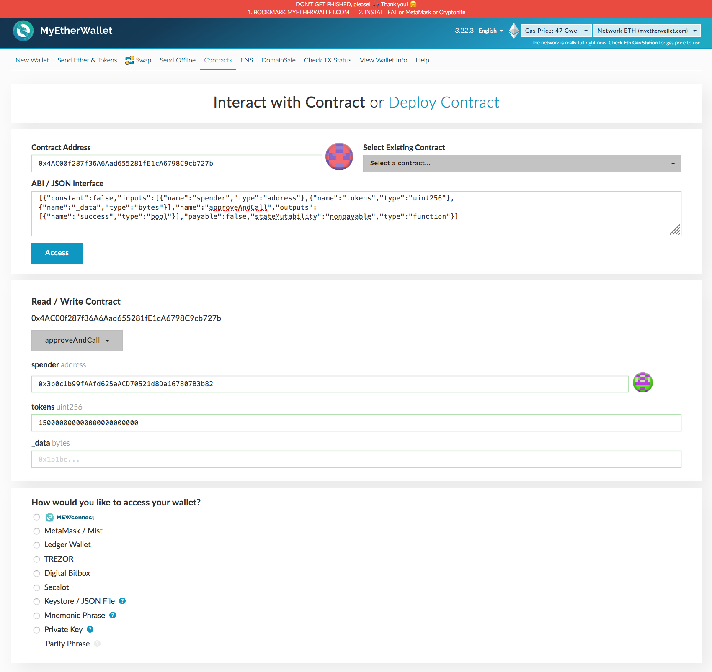
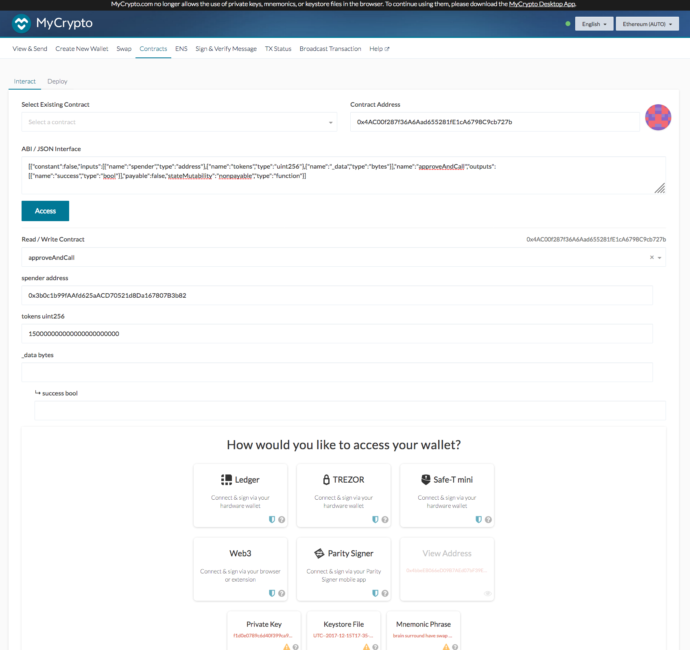
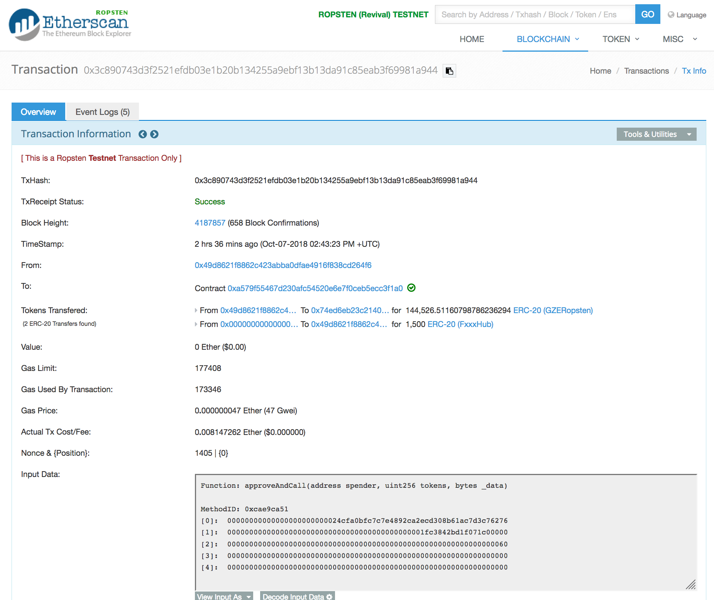

# Purchasing Land Parcels In The FXXX Land Rush

## Mainnet FXXX Land Rush

Note that this following data is available in JSON format from [scripts/FxxxLandRushSummary.json](scripts/FxxxLandRushSummary.json). This live updated data will be available from a specified server at a later date.

Component                  | Address                                   
:------------------------- |:------------------------------------------
GZE GazeCoin Token         | 0x4AC00f287f36A6Aad655281fE1cA6798C9cb727b [&#x1F517;](https://etherscan.io/token/0x4AC00f287f36A6Aad655281fE1cA6798C9cb727b)
BonusList                  | 0x57D2F4B8F55A26DfE8Aba3c9f1c73CADbBc55C46 [&#x1F517;](https://etherscan.io/address/0x57D2F4B8F55A26DfE8Aba3c9f1c73CADbBc55C46)
MakerDAOPriceFeedAdaptor   | 0xF31AA1dFbEd873Ab957896a0204a016F5E123e02 [&#x1F517;](https://etherscan.io/address/0xF31AA1dFbEd873Ab957896a0204a016F5E123e02)
GZE/ETH PriceFeed          | 0xD649c9b68BB78e8fd25c0B7a9c22c42f57768c91 [&#x1F517;](https://etherscan.io/address/0xD649c9b68BB78e8fd25c0B7a9c22c42f57768c91)
FxxxHub Token              | 0x5B98a13e7c6Aef063551643B0171d5Cd681BF4da [&#x1F517;](https://etherscan.io/token/0x5B98a13e7c6Aef063551643B0171d5Cd681BF4da)
FxxxHub FxxxLandRush       | 0x3b0c1b99fAAfd625aACD70521d8Da167807B3b82 [&#x1F517;](https://etherscan.io/address/0x3b0c1b99fAAfd625aACD70521d8Da167807B3b82#readContract)
FxxxRk Token               | 0xd73b9d06bffA9d8B6D2E5f03de578103531215fF [&#x1F517;](https://etherscan.io/token/0xd73b9d06bffA9d8B6D2E5f03de578103531215fF)
FxxxRk FxxxLandRush        | 0x460E0e607eBD39C8927210A7f32ef7bD170F7d40 [&#x1F517;](https://etherscan.io/address/0x460E0e607eBD39C8927210A7f32ef7bD170F7d40#readContract)
FxxxDude Token             | 0xc70ABb3546D0976d91D91AaD2773fAE69e106599 [&#x1F517;](https://etherscan.io/token/0xc70ABb3546D0976d91D91AaD2773fAE69e106599)
FxxxDude FxxxLandRush      | 0xbF68F58CE089b97b2F7146d2EC097F5Af9Ac217F [&#x1F517;](https://etherscan.io/address/0xbF68F58CE089b97b2F7146d2EC097F5Af9Ac217F#readContract)
FxxxBooty Token            | 0xBC844A541855Cb797163e7f4344616a97a89ccB2 [&#x1F517;](https://etherscan.io/token/0xBC844A541855Cb797163e7f4344616a97a89ccB2)
FxxxBooty FxxxLandRush     | 0xf9A6d564217c44ab64E28C7F34CB8fE246f57539 [&#x1F517;](https://etherscan.io/address/0xf9A6d564217c44ab64E28C7F34CB8fE246f57539#readContract)

The **FxxxHub** land rush starts at:
* Oct 16 2018 15:00 PST
* Oct 16 2018 23:00 UTC
* Oct 17 2018 10:00 AEST

The **FxxxHub** land rush ends at:
* Nov 16 2018 15:00 PST
* Nov 16 2018 23:00 UTC
* Nov 17 2018 10:00 AEST

The **FxxxRk**, **FxxxDude** and **FxxxBooty** land rushes start at:
* Nov 19 2018 15:00 PST
* Nov 19 2018 23:00 UTC
* Nov 20 2018 10:00 AEST

The **FxxxRk**, **FxxxDude** and **FxxxBooty** land rushes end at:
* Dec 08 2018 15:00 PST
* Dec 08 2018 23:00 UTC
* Dec 09 2018 10:00 AEST

<br />

<hr />

## Ropsten Testnet FXXX Land Rush

Note that this following data is available in JSON format from [scripts/FxxxLandRushSummary_Ropsten.json](scripts/FxxxLandRushSummary_Ropsten.json). This live updated data will be available from a specified server at a later date.

Component                  | Address                                   
:------------------------- |:------------------------------------------
GZE GazeCoin Token         | 0xA579f55467d230AfC54520e6e7F0CEB5ECC3f1A0 [&#x1F517;](https://ropsten.etherscan.io/token/0xA579f55467d230AfC54520e6e7F0CEB5ECC3f1A0)
BonusList                  | 0xe0a1B299cF4b4786E56FCD27Bc20F656384073a0 [&#x1F517;](https://ropsten.etherscan.io/address/0xe0a1B299cF4b4786E56FCD27Bc20F656384073a0)
ETH/USD PriceFeed          | 0x67C2E24f0EA4314Cc7D2a85e7809Dc2b43E6440A [&#x1F517;](https://ropsten.etherscan.io/address/0x67C2E24f0EA4314Cc7D2a85e7809Dc2b43E6440A)
GZE/ETH PriceFeed          | 0x62ca617DeEcCEA9D3Ebf1EA354Eba4300292071D [&#x1F517;](https://ropsten.etherscan.io/address/0x62ca617DeEcCEA9D3Ebf1EA354Eba4300292071D)
FxxxHub Token              | 0xd5F08AD7105Cf766853aeF84B846258c9fd7Bb84 [&#x1F517;](https://ropsten.etherscan.io/token/0xd5F08AD7105Cf766853aeF84B846258c9fd7Bb84)
FxxxHub FxxxLandRush       | 0x24Cfa0BFc7C7E4892cA2ECd308b61ac7D3C76276 [&#x1F517;](https://ropsten.etherscan.io/address/0x24Cfa0BFc7C7E4892cA2ECd308b61ac7D3C76276#readContract)
FxxxRk Token               | 0xC1C6B1eFF2C4ab247E1194Fd8b14c478550E68a1 [&#x1F517;](https://ropsten.etherscan.io/token/0xC1C6B1eFF2C4ab247E1194Fd8b14c478550E68a1)
FxxxRk FxxxLandRush        | 0x3DAf29FcB450CaC2fD27C27334ccF156B60cFe5D [&#x1F517;](https://ropsten.etherscan.io/address/0x3DAf29FcB450CaC2fD27C27334ccF156B60cFe5D#readContract)
FxxxDude Token             | 0x218778176eC72DD8847E9BceFc14002822Fe9d26 [&#x1F517;](https://ropsten.etherscan.io/token/0x218778176eC72DD8847E9BceFc14002822Fe9d26)
FxxxDude FxxxLandRush      | 0x567CD0AdD4a652b32B0404950E62944263eb3d2C [&#x1F517;](https://ropsten.etherscan.io/address/0x567CD0AdD4a652b32B0404950E62944263eb3d2C#readContract)
FxxxBooty Token            | 0xCF618D39C4e069dE2b6Ae9D9B65D7bB0b7a562AA [&#x1F517;](https://ropsten.etherscan.io/token/0xCF618D39C4e069dE2b6Ae9D9B65D7bB0b7a562AA)
FxxxBooty FxxxLandRush     | 0xC710292C90d9243D9F860832ea46977AC46E93A3 [&#x1F517;](https://ropsten.etherscan.io/address/0xC710292C90d9243D9F860832ea46977AC46E93A3#readContract)
Wallet                     | 0x74eD6Eb23c21403d7A00Bf388a2ec691b98BA8Ed [&#x1F517;](https://ropsten.etherscan.io/address/0x74eD6Eb23c21403d7A00Bf388a2ec691b98BA8Ed)

The **FxxxHub**, **FxxxRk**, **FxxxDude** and **FxxxBooty** land rushes started on Oct 08 2018

The **FxxxHub** land rush ends at:
* Nov 16 2018 15:00 PST
* Nov 16 2018 23:00 UTC
* Nov 17 2018 10:00 AEST

The **FxxxRk**, **FxxxDude** and **FxxxBooty** land rushes end at:
* Dec 08 2018 15:00 PST
* Dec 08 2018 23:00 UTC
* Dec 09 2018 10:00 AEST

<br />

<hr />

## Purchasing Parcels

The cost per parcel of land is USD 1,500 for **FxxxHub**, and a USD amount for **FxxxRk**, **FxxxDude** and **FxxxBooty**.

In the JSON file, these rates will be reported in the fields (only relevant fields displayed below):

```json
"fxxxLandRushes": [
  {
    "address": "0x24Cfa0BFc7C7E4892cA2ECd308b61ac7D3C76276",
    "nameAddress": "FxxxLandRush 'Fantasy Hub':0x24Cfa0BFc7C7E4892cA2ECd308b61ac7D3C76276",
    "name": "Fantasy Hub",
    "parcelEthRate": 6.706608244657068765,
    "parcelEthLive": "true",
    "parcelGzeWithoutBonusRate": 173431.813929585434835528,
    "parcelGzeWithoutBonusLive": "true",
    "parcelGzeWithBonusOffListRate": 144526.51160798786236294,
    "parcelGzeWithBonusOffListLive": "true",
    "parcelGzeWithBonusOnListRate": 133409.087638142642181175,
    "parcelGzeWithBonusOnListLive": "true",
  }
]
```

If the ETH/USD or GZE/ETH rates are unavailable, the **\*Live** flag will be set to **false**.

<br />

### Cost When Purchasing With GZE
The amount of GZE (GazeCoin) to purchase a single parcel of land is determined by the USD cost adjusted by the GZE/ETH and ETH/USD rates at the time of purchase.

The cost in GZE for a single parcel can be viewed by clicking on the appropriate FxxxLandRush contract (linked above). If the purchasing account has been added to the BonusList, there is a 30% discount, and the cost per parcel is displayed in the *parcelGzeWithBonusOnList* field. If the purchasing account has NOT been added to the BonusList, there is a 20% discount, and the cost per parcel is displayed in the *parcelGzeWithoutBonus* field.

<br />

### Cost When Purchasing With ETH
The amount of ETH (Ethers) to purchase a single parcel of land is determined by the USD cost adjusted by the ETH/USD rate at the time of purchase.

<br />

### Purchasing Parcels With GZE

* Select the [Contracts](https://www.myetherwallet.com/#contracts) tab in [MyEtherWallet](https://www.myetherwallet.com/), or the [Contracts](https://mycrypto.com/contracts/interact) tab in [MyCrypto](https://mycrypto.com/contracts/)
* Select *Network*
  * For Mainnet, select one of the **ETH** networks in MyEtherWallet, or on of the **Ethereum** networks in MyCrypto
  * For the Ropsten Testnet, select one of the **Ropsten** networks in MyEtherWallet, or on of the **Ropsten** networks in MyCrypto
* In *Contract Address*
  * For Mainnet, enter the GZE token address `0x4AC00f287f36A6Aad655281fE1cA6798C9cb727b`
  * For the Ropsten Testnet, enter the Ropsten GZE token address `0xA579f55467d230AfC54520e6e7F0CEB5ECC3f1A0`
* In *ABI / JSON Interface*, enter the text `[{"constant":false,"inputs":[{"name":"spender","type":"address"},{"name":"tokens","type":"uint256"},{"name":"_data","type":"bytes"}],"name":"approveAndCall","outputs":[{"name":"success","type":"bool"}],"payable":false,"stateMutability":"nonpayable","type":"function"}]`
* Click *Access*
* Under *Read / Write Contract*, select **approveAndCall**
* In the *spender* field, enter the desired **FxxxLandRush** address (see table above)
* In the *tokens* field, enter the number of GZE tokens used to purchase one or more parcels of land. Refer to the *Cost* section above to determine the number of GZE tokens required to purchase a single parcel of land. Multiples of this number can be specified to purchase multiple parcels of land. Add a few percent more on top of this number to cater for changes in the exchange rate. Only the correct amounts will be used to purchase the one (or multiple) parcels of land, and any excess will be refunded.
* Leave the *_data* field blank
* Click *Write*
* Select your desired method to access your wallet, and execute the transaction.

<br />

<kbd></kbd>

Purchase by executing `GZE.approveAndCall(landRushAddress, tokens, "")` in MyEtherWallet.

<br />

<kbd></kbd>

Purchase by executing `GZE.approveAndCall(landRushAddress, tokens, "")` in MyCrypto.

<br />

<kbd></kbd>

Sample Ropsten Testnet FxxxLandRush [transaction](https://ropsten.etherscan.io/tx/0x3c890743d3f2521efdb03e1b20b134255a9ebf13b13da91c85eab3f69981a944).

<br />

### Purchasing Parcels With ETH

Purchase using ETH by sending ETH directly to the *FxxxLandRush* contract address. Refer to the *Cost* section above to determine the number of ETH required to purchase a single parcel of land. Multiples of this number can be specified to purchase multiple parcels of land. Add a few percent more on top of this number to cater for changes in the exchange rate. Only the correct amounts will be used to purchase the one (or multiple) parcels of land, and any execess will be refunded.

<br />

(c) BokkyPooBah / Bok Consulting Pty Ltd for GazeCoin - Oct 08 2018. The MIT Licence.
